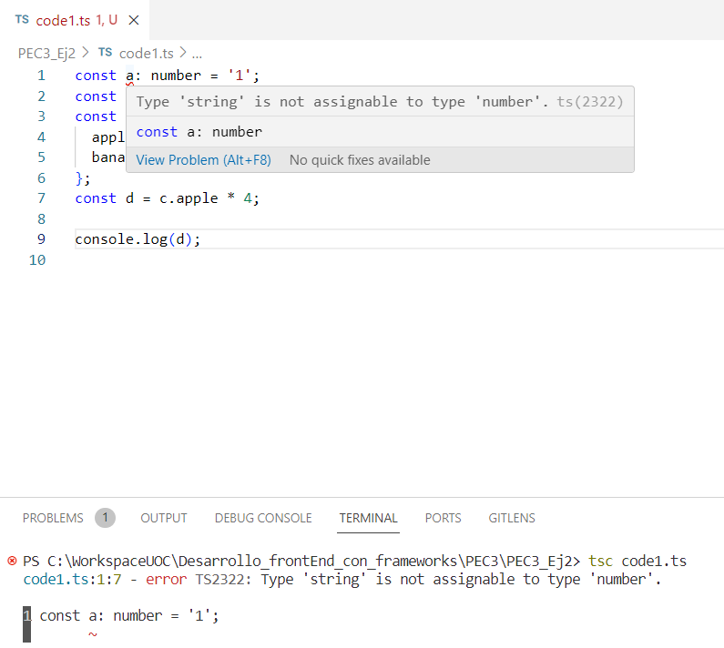

# Modifica el código para conseguir que aparezca una línea roja de error en el IDE avisándote de que se está disparando un TypeError. Explica por qué se ha producido esto y qué ventajas tiene.

Este error se debe a que el valor no es del tipo esperado ya que, en este caso, se asigna el tipo 'number' y el valor es un 'string'. 

Respecto a las ventajas, se encuentran las siguientes:

 - Detección de errores durante la compilación, evitando errores lógicos en el código antes de la ejecución.
 - El código es más legible, comprendiendo con mayor facilidad qué tipo de dato se espera en una variable o función.
 - Mayor rendimiento debido a que el compilador puede realizar optimizaciones específicas al conocerse los tipos de datos, realizándose ejecuciones más rápidas y eficientes.
 - Mejor mantenimiento porque, al detectarse errores durante la compilación, se facilita la modificación y expansión del código, además de que se entiende más rápidamente cómo interactúan las variables y funciones.
 - Reduce la posibilidad de errores en tiempo de ejecución.
 - Mejora la herramienta de desarrollo (IDE) ya que pueden aprovechar la información de tipo para ofrecer sugerencias y correcciones automáticas, mejorando la productividad.

 # 1. Para cada uno de los valores del fichero code2.ts, ¿Qué tipo de datos inferirá TypeScript? Explica por qué se ha inferido este tipo de datos.

 a: tipo number
 b: tipo string
 c: tipo string
 d: array de tipo boolean
 e: object, donde type es de tipo string
 f: tupla de tipo number y/o boolean
 g: array de tipo number
 h: tipo null

 Typescript infiere el dato cuando se realiza una inicialización de la variable. Dependiendo del valor inferido, Typescript lo reconoce asignándole el tipo de dato correspondiente. En caso de que no se inicialice, establece por defecto el tipo any. 

# 2. ¿Por qué se dispara cada uno de los errores del fichero code3.ts?

1. Error TS2588 (SyntaxError): una variable declarada con const no puede modificar su valor ni volverse a declarar.

2. Error TS2345 (TypeError): j es un array de tipo number y no acepta la adición de otros tipos de datos, como en este caso string.

3. Error TSTS2322 (TypeError): k es de tipo never (asignado en arrays vacíos, en funciones infinitas o cuando se devuelve un error lanzado mediante un throw) así que no es compatible con el tipo de dato asignado, que es number.

4. Error TS2571 (TypeError): existe incompatibilidad al realizar operaciones entre dos tipos de datos distintos, en este caso unknown y number. l es de tipo unknown, que permite la asignación de cualquier tipo de dato, pero no se puede asignar a nada más que a sí mismo, además, no se permiten operaciones con un objeto de tipo unknown sin antes limitarlo a un tipo más especifico.

# 3. ¿Cuál es la diferencia entre una clase y una interface en TypeScript?

Las clases se utilizan para crear objetos concretos, mientras que las interfaces se utilizan para definir qué propiedades y métodos deben seguir las clases. En cuanto a la implementación de métodos y propiedades, en una clase puedes definirlas con implementaciones concretas, mientras que en una interfaz no hay implementación de métodos, sino que solo se declara la estructura que debe seguir cualquier clase que la implemente. Además, una clase puede implementar múltiples interfaces, permitiendo la adición de sus respectivas estructuras definidas. Por ejemplo:

interface Saludo {
  saludar(): void;
}

class Persona implements Saludo {
  nombre: string;

  constructor(nombre: string) {
    this.nombre = nombre;
  }

  saludar() {
    console.log(`Hola, soy ${this.nombre}`); 
  }
}

Como puede verse, la clase Persona debe contener la estructura definida en la interfaz, en este caso el método saludar(), que no devuelve nada (void), pero muestra en consola un mensaje.

